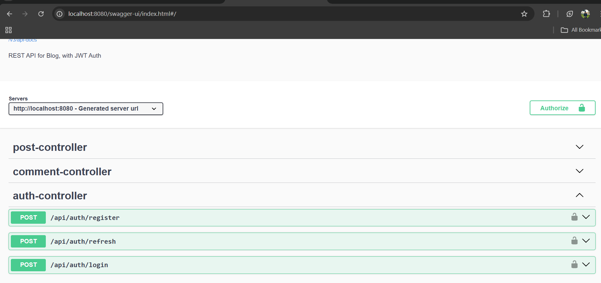
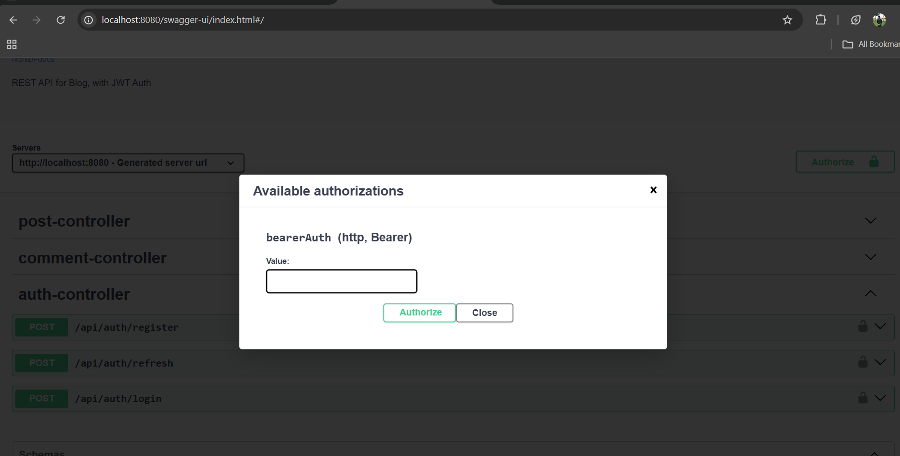
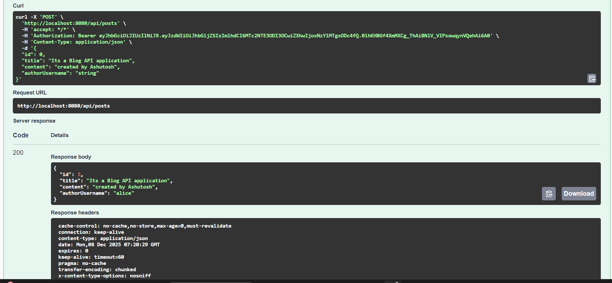
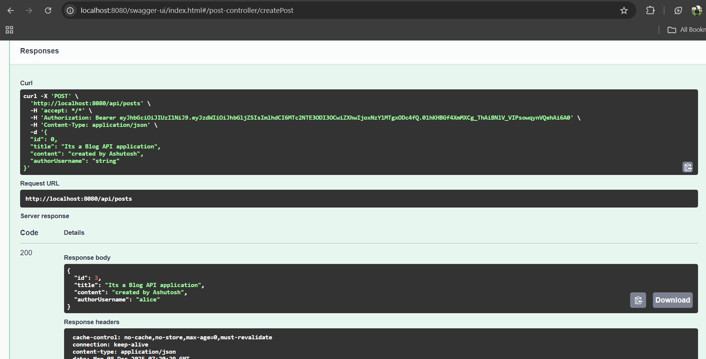
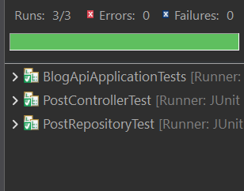

📘 Blog API – Spring Boot + JWT + Swagger

A RESTful blog management API built using Spring Boot, Spring Security (JWT), MySQL, Swagger, and JUnit tests.
Supports user authentication, blog post management, and commenting features with role-based access.

🚀 Features

✔ User authentication (Register & Login)
✔ JWT-based authorization with Bearer tokens
✔ CRUD for Blog Posts
✔ CRUD for Comments
✔ Pagination & Sorting for posts
✔ Validation & Global Exception Handling
✔ Unit & Integration Tests
✔ Swagger UI for API testing
✔ MySQL database support
✔ Role-based access (USER / ADMIN)

🗄️ Tech Stack
Backend	- Spring Boot
Authentication	- Spring Security + JWT
Database - MySQL
Testing	- JUnit + MockMvc 
API Docs - Swagger 
Build - Maven

⚙️ Installation & Setup

1️⃣ Clone the Repository

git clone <your-github-repo-url>
cd blog-api

2️⃣ Database Setup

Create MySQL database:

CREATE DATABASE blogdb;

Or import SQL from:

📁 docs/schema.sql

3️⃣ Configure Database

Edit application.properties:

spring.datasource.url=jdbc:mysql://localhost:3306/blogdb
spring.datasource.username=root
spring.datasource.password=yourpassword
spring.jpa.hibernate.ddl-auto=update
⚠️ Replace DB username & password as per your machine.

4️⃣ Build & Run
mvn clean install
mvn spring-boot:run

🌐 Swagger API Documentation

After starting the application, open:

👉 http://localhost:8080/swagger-ui/index.html

### 📌 Swagger API Endpoints
This screenshot shows the documented controllers and routes available in the Blog API through Swagger UI.

Enable JWT Authorization in Swagger:

Click Authorize

Enter:
Bearer <your-jwt-token>

### 🔐 JWT Authorization in Swagger

Click Authorize → Close

Now protected endpoints will work.

🔐 Authentication Endpoints
Register User

POST /api/auth/register

Body:

{
  "username": "demo",
  "password": "123456",
  "email": "demo@gmail.com"
}

Login

POST /api/auth/login

Body:

{
  "username": "demo",
  "password": "123456"
}

Response:

{
  "token": "JWT-TOKEN-HERE"
}

Use JWT token for authorization:

Authorization: Bearer <token>

✏️ Post API Endpoints
Create Post

POST /api/posts

Body:

{
  "title": "First Blog",
  "content": "This is my first post"
}

Get All Posts

GET /api/posts?page=0&size=5&sort=createdAt,desc

Get Post by ID

GET /api/posts/{id}

### ✔ Successful Authorized Request

Update Post

PUT /api/posts/{id}

Delete Post

DELETE /api/posts/{id}

💬 Comment API Endpoints

Add Comment

POST /api/comments

Body:

{
  "postId": 1,
  "content": "Nice blog"
}

Get Comments by Post

GET /api/comments?postId=1

🧪 Testing

We use:

@SpringBootTest → App context test

@WebMvcTest → Controller test using MockMvc

@DataJpaTest → Repository test with in-memory DB

Run tests:

mvn test

All tests must show GREEN bar to confirm API is working.

📄 Database Schema

Schema file is available at:

📁 docs/schema.sql

Contains tables:

Users

Posts

Comments

📤 Project Deliverables

This project satisfies:

✔ Fully functional RESTful API
✔ Database schema and SQL script
✔ Comprehensive Swagger documentation
✔ Unit and integration tests
✔ GitHub repository with complete source code

👏 Author

✍️ Developed by: Ashutosh Kumar
📅 Year: 2025